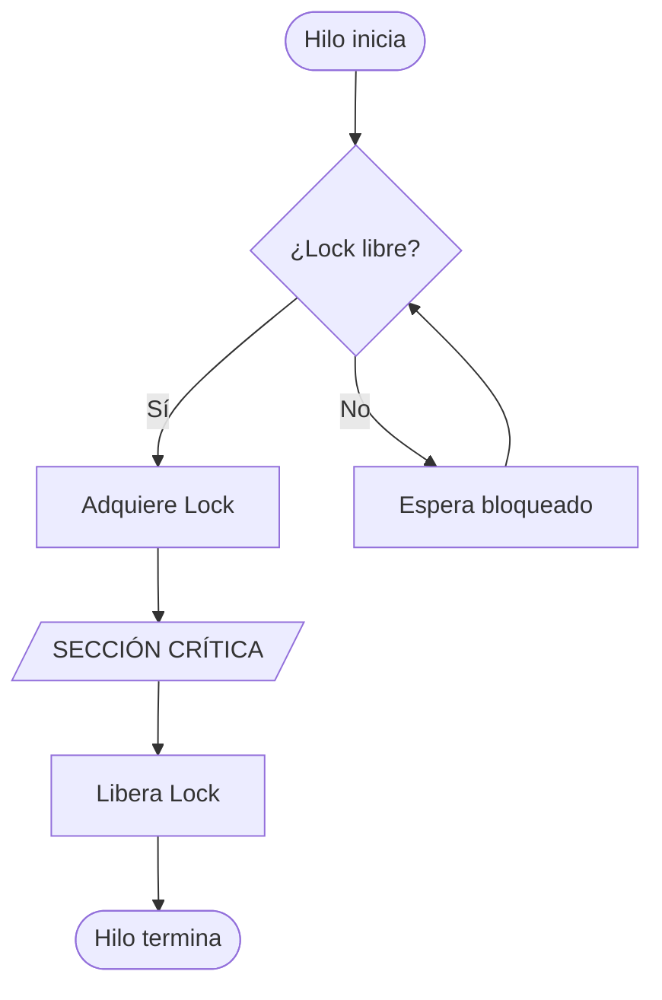
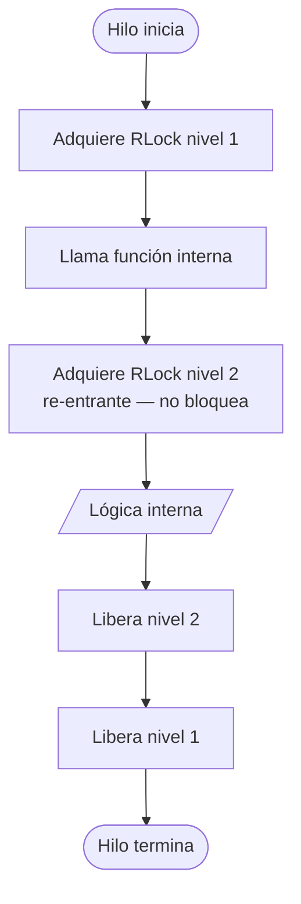
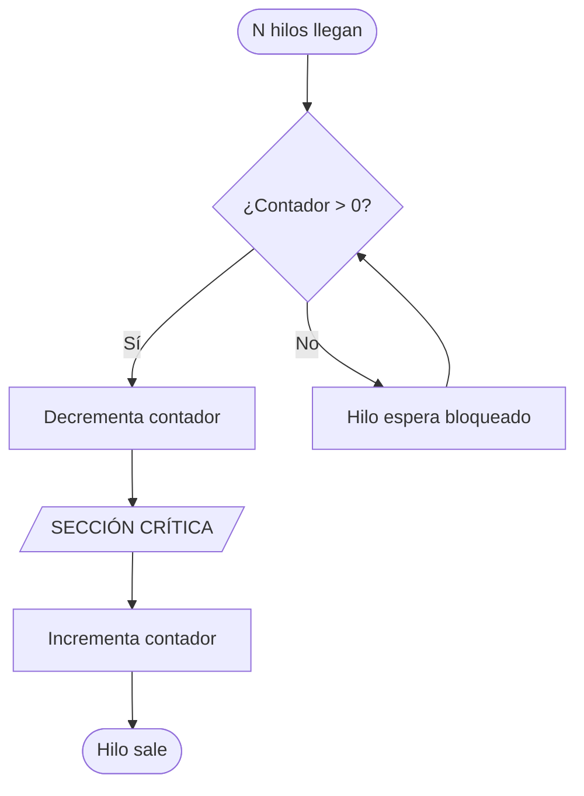
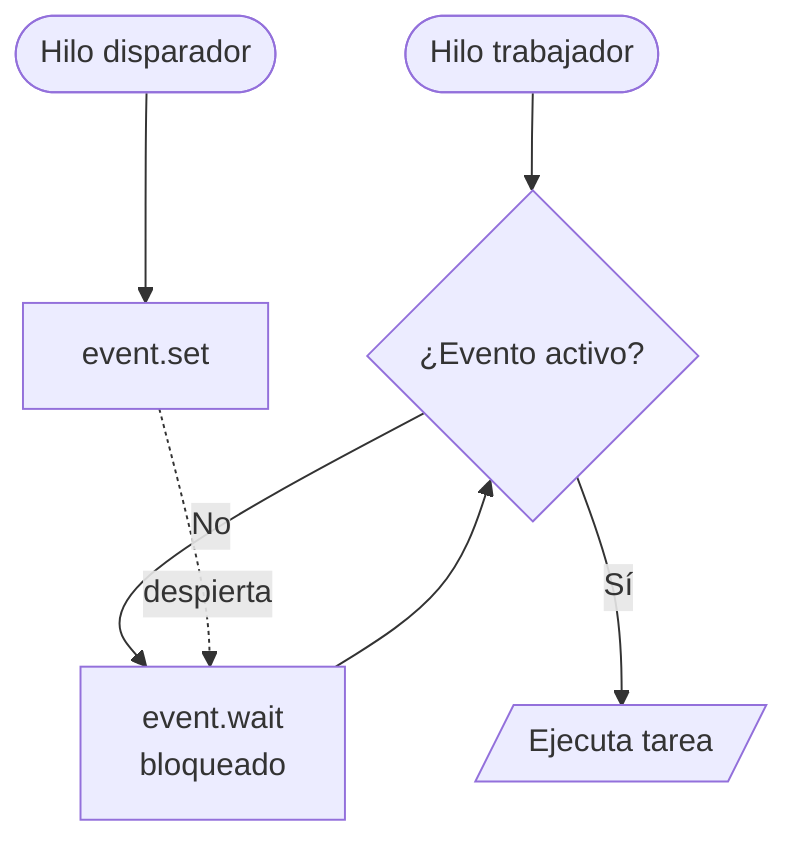
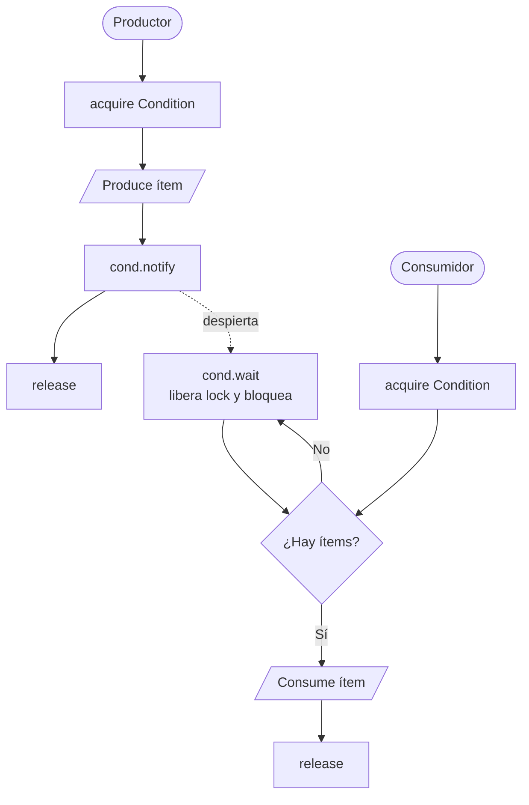
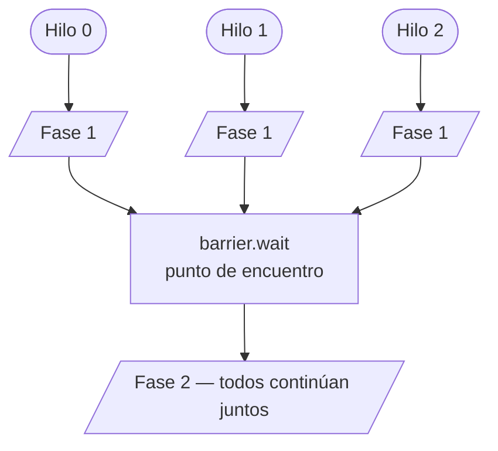

# Primitivas de Sincronización de Procesos

## 1. Lock — Exclusión mutua básica

Solo un hilo puede estar en la sección crítica a la vez.

---

## 2. RLock — Lock re-entrante

El mismo hilo puede adquirir el lock múltiples veces sin provocar un deadlock.

---

## 3. Semaphore — Acceso limitado a N hilos

El semáforo mantiene un contador interno. Solo `N` hilos pueden estar en la sección crítica simultáneamente.

---

## 4. Event — Señalización entre hilos

Los hilos esperan una señal para continuar. Un hilo disparador llama a `event.set()`.

---

## 5. Condition — Esperar/notificar con condición compartida

Combina un lock con la capacidad de `wait` y `notify`. Ideal para el patrón productor–consumidor.

---

## 6. Barrier — Punto de encuentro

Todos los hilos deben llegar a la barrera antes de que cualquiera pueda continuar.

---

## Resumen comparativo

| Primitiva   | Hilos permitidos | Uso principal                         |
|-------------|-----------------|---------------------------------------|
| `Lock`      | 1               | Exclusión mutua simple                |
| `RLock`     | 1 (re-entrante) | Funciones que se llaman recursivamente|
| `Semaphore` | N               | Limitar acceso concurrente            |
| `Event`     | Todos a la vez  | Señal de arranque o notificación      |
| `Condition` | 1 + notificación| Productor–Consumidor                  |
| `Barrier`   | Todos sincronizan| Fases coordinadas entre hilos        |
